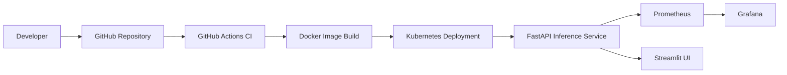
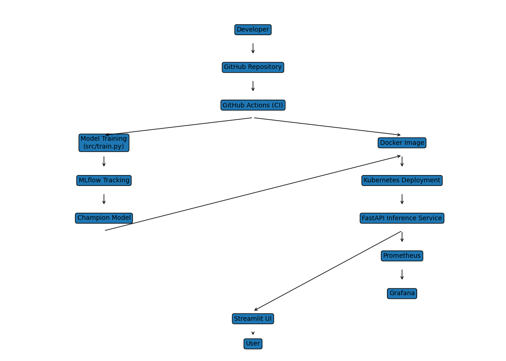

# 🐶 Cats vs Dogs – End-to-End MLOps Pipeline 🐱

## Project Overview

This project implements a full end-to-end MLOps pipeline for binary image classification (Cats vs Dogs), covering:

* Model development
* Experiment tracking
* Model packaging
* Containerization
* CI/CD automation
* Kubernetes deployment
* Monitoring & observability
* Production-ready UI

The system is fully containerized and deployed on a local Kubernetes cluster.

---

## Flow Chart


---

## System Architecture



---

## Model Development (M1)

* Dataset: Kaggle Cats vs Dogs
* Preprocessing:

  * Resize to 224x224
  * RGB normalization
  * Data augmentation
* Model:

  * ResNet18 (Transfer Learning)
* Experiment tracking:

  * MLflow
* Model versioning:

  * Champion promotion mechanism

Artifacts tracked:

* Model weights
* Metrics
* Confusion matrix
* Parameters

---

## Model Packaging (M2)

* FastAPI inference service
* Endpoints:

  * `/health`
  * `/predict`
  * `/metrics`
* Requirements pinned for reproducibility
* Dockerized using Python 3.11-slim

---

## Continuous Integration (M3)

GitHub Actions pipeline runs on every PR:

* Install dependencies
* Run pytest unit tests
* Run Ruff lint checks
* Build Docker image

---

## Deployment (M4)

Deployment target: Kubernetes (Docker Desktop)

Resources:

* Deployment
* LoadBalancer service
* Liveness & readiness probes
* Rolling updates

---

## Monitoring & Observability (M5)

* Prometheus scraping `/metrics`
* Grafana dashboard:

  * Request count
  * Latency
* Application-level logging
* Streamlit UI for live inference

---

## User Interface

Streamlit-based UI allows:

* Image upload
* Live prediction
* Confidence visualization
* Metrics display

---

## Tech Stack

* PyTorch
* MLflow
* FastAPI
* Docker
* Kubernetes
* GitHub Actions
* Prometheus
* Grafana
* Streamlit

---

## Project Structure

```
bits_s3_mlops_assignment_2/
│
├── src/
│   ├── train.py
│   ├── model.py
│   ├── inference.py
│   └── ...
│
├── tests/
├── k8s/
├── ui/
├── Dockerfile
├── requirements.txt
└── README.md
```

---


# Setup & Execution Guide

This guide walks through the full pipeline from training to deployment.

---

## Prerequisites

Make sure the following are installed:

* Python 3.11+
* Docker Desktop (Kubernetes enabled)
* kubectl
* Git

Enable Kubernetes in Docker Desktop:

```
Settings → Kubernetes → Enable Kubernetes
```

---

## 1. Clone Repository

```powershell
git clone <your-repo-url>
cd bits_s3_mlops_assignment_2
```

---

## 2. Create Virtual Environment

```powershell
python -m venv .venv
.venv\Scripts\activate
```

Install dependencies:

```powershell
pip install -r requirements.txt
```

---

## 3. Model Training

Train the model:

```powershell
python src\train.py
```

This will:

* Train ResNet18
* Log experiment to MLflow
* Save model artifact
* Register model

To launch MLflow UI:

```powershell
mlflow ui
```

Open:

```
http://localhost:5000
```

---

## 4. Export Champion Model

Promote best model (if not already):

```powershell
python src\promote_model.py
```

Export for inference:

```powershell
python src\export_model.py
```

This creates:

```
models/champion/
```

---

## 5. Run Inference Locally (Without Docker)

```powershell
uvicorn src.inference:app --reload
```

Open:

```
http://localhost:8000/docs
```

Test:

* `/health`
* `/predict`

---

## 6. Build Docker Image 

```powershell
docker build -t cats-dogs-inference .
```

Run container:

```powershell
docker run -p 8000:8000 cats-dogs-inference
```

Test:

```
http://localhost:8000/health
```

---

## 7. Deploy to Kubernetes

Ensure Docker Desktop Kubernetes is running.

Apply manifests:

```powershell
kubectl apply -f k8s/deployment.yaml
kubectl apply -f k8s/service.yaml
```

Check pods:

```powershell
kubectl get pods
```

Port forward:

```powershell
kubectl port-forward service/cats-dogs-service 9000:80
```

Test:

```
http://localhost:9000/health
```

---

## 8. Run Streamlit UI

In a new terminal:

```powershell
streamlit run ui/app.py
```

Open:

```
http://localhost:8501
```

---

## 9. Deploy Prometheus & Grafana

Apply monitoring stack:

```powershell
kubectl apply -f k8s/prometheus.yaml
kubectl apply -f k8s/grafana.yaml
```

Check services:

```powershell
kubectl get svc
```

Access:

Prometheus:

```
http://localhost:30090
```

Grafana:

```
http://localhost:30030
```

---

## 10. Run Tests

```powershell
pytest -v
```

Run lint check:

```powershell
ruff check .
```

---

## CI Pipeline (Automatic)

On every Pull Request:

* Dependencies installed
* Tests executed
* Lint checks run
* Docker image built

GitHub Actions handles this automatically.

---

## Quick Start Summary

If you just want to run everything quickly:

```powershell
python -m venv .venv
.venv\Scripts\activate
pip install -r requirements.txt
python src\train.py
docker build -t cats-dogs-inference .
kubectl apply -f k8s/
kubectl port-forward service/cats-dogs-service 9000:80
streamlit run ui/app.py
```

